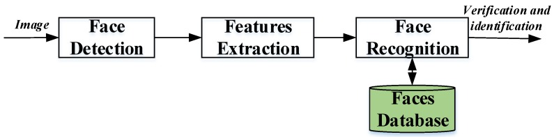

# Face Recognition

## Instalation

1. `sudo pacman -S opencv`

## Pipeline

1. Video acquisition
2. Face Detection
3. Feature Extraction
3. Face Recognition



## Most important code:
https://docs.opencv.org/4.x/d0/dd4/tutorial_dnn_face.html

## Face Detection

https://www.geeksforgeeks.org/opencv-c-program-face-detection/

## Face Recognition

https://docs.opencv.org/3.4/da/d60/tutorial_face_main.html


# How to code?

First we need to save the person model beforehand, setting up the person who will be able to thresspass security.
Then, the idea is to run an video as a "real time camera" and accept that person if the video contains the person.


## References

1. [Reference Article](https://www.mdpi.com/1424-8220/20/2/342) 
2. [OpenCV Site for face Recognition](https://docs.opencv.org/3.4/da/d60/tutorial_face_main.html)
3. [Face Detection](https://www.geeksforgeeks.org/opencv-c-program-face-detection/)

# Usage of example gaved by OpenCV:
Compile with:

```bash
g++ face_reco_example.cpp -L /usr/lib64/libopencv_*  -I/usr/include/opencv4  -o face_reco_example
```

Run example
```
./face_reco_example --i1=./data/rock_02.jpg --i2=./data/rock_03.jpg --fd=./face_detection_yunet_2023mar.onnx --fr=./face_recognition_sface_2021dec.onnx
```

# Hardware used:

OpenCV Version 4.9.0  
g++ (GCC) 13.2.1 20230801

System:

 - Kernel: 6.1.85-1-MANJARO arch x86_64 bits 64 compiler gcc v 13.2.1
 - Desktop: i3 v 4.23 Manjaro - Arch Linux  

CPU:
 - Info: 8-core AMD Ryzen 7 2700 64 bits 
 - Freq: min/max 1550/3200 

Graphics:
 - Device: NVIDIA TU106 [GeForce RTX 2060 Rev. A] Gigabyte
 - Driver: nvidia v550.67

Info:
 - Memory: 32 GiB
